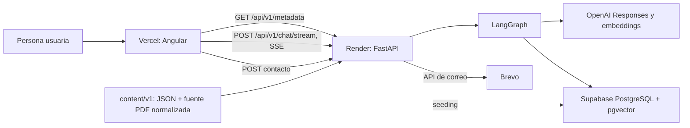

# Guía técnica de arquitectura — Portfolio Lucas 2026

Esta guía sirve para explicar el proyecto con seguridad en una entrevista: primero el mapa completo, luego cada límite técnico y finalmente una forma breve de contarlo. El producto combina un portfolio estático en Angular con un chat fundamentado en el CV; si el servicio de chat no está disponible o no es compatible, las rutas estáticas siguen funcionando.

## Ruta rápida de explicación

1. **Problema:** presentar experiencia profesional de forma navegable y responder preguntas sin inventar datos del CV.
2. **Diseño:** Angular entrega la interfaz; FastAPI expone una API; LangGraph decide cuándo recuperar evidencia; OpenAI genera y embebe; Supabase/pgvector conserva el índice del PDF; Brevo entrega contactos.
3. **Garantía principal:** una afirmación marcada como procedente del portfolio sólo se acepta con citas controladas por el servidor.
4. **Degradación:** Angular verifica versión de contenido/protocolo y deshabilita sólo el chat ante incompatibilidad o arranque en frío; el portfolio sigue navegable.

## 1. Mapa del sistema y flujo de datos



**Alternativa textual del diagrama (también aplicable al PDF):**

| Origen | Destino | Responsabilidad |
|---|---|---|
| Navegador | Vercel/Angular | Sirve la SPA y el contenido estático validado. |
| Angular | Render/FastAPI | Consulta metadatos, consume chat por SSE y envía el formulario de contacto. |
| FastAPI | LangGraph | Ejecuta la política de seguridad, recuperación, generación y validación. |
| LangGraph | OpenAI | Obtiene respuesta y embeddings a través de adaptadores del backend. |
| LangGraph | Supabase pgvector | Busca fragmentos relevantes del PDF y devuelve página/archivo. |
| FastAPI | Brevo | Entrega contactos aceptados. |

### Flujo de una pregunta de chat

1. `ChatPage` consulta `GET /api/v1/metadata` antes de habilitar el chat.
2. Si `content_version` y `protocol_version` coinciden, `ChatClient` hace `POST /api/v1/chat/stream`.
3. FastAPI crea un estado de `ChatGraphState` y ejecuta LangGraph.
4. El grafo evalúa seguridad, pide una primera respuesta al proveedor y sólo recupera del PDF si el proveedor solicita `search_portfolio`.
5. La recuperación vectorial devuelve evidencia con página y archivo; una segunda generación usa esa evidencia.
6. El backend valida las partes, añade las citas propias del servidor y emite eventos SSE ordenados.
7. Angular valida cada evento y actualiza el estado de la conversación con señales.

## 2. Frontend Angular

### Estructura y rutas

La aplicación es una SPA Angular con componente raíz mínimo (`App` contiene `RouterOutlet`). Las rutas no duplican vistas: las URLs de portfolio redirigen a secciones de la página de recorrido; el resolver carga y valida el bundle de contenido antes de renderizar.

```ts
export const routes: Routes = [
  {
    path: '',
    pathMatch: 'full',
    component: JourneyPage,
    resolve: { content: validatedPortfolioResolver },
  },
  { path: 'perfil', pathMatch: 'full', redirectTo: redirectToFragment('intro') },
  { path: 'chat', pathMatch: 'full', redirectTo: redirectToFragment('assistant') },
  { path: CONTENT_UNAVAILABLE_PATH, component: ContentUnavailablePage },
];
```

**Qué explica:** `JourneyPage` es la composición principal. `perfil`, experiencia, educación, habilidades, proyectos y chat son enlaces estables a fragmentos, no aplicaciones separadas. Si el contenido local no cumple el contrato, existe una pantalla específica de indisponibilidad.

| Área | Responsabilidad |
|---|---|
| `core/content` | Carga, validación de esquema, hashes y procedencia del bundle versionado. |
| `core/config` | Define `API_BASE_URL`, inyectada en build por Vercel. |
| `core/routing` | Resolver de contenido y tratamiento de errores de navegación. |
| `features/journey` | Página narrativa principal. |
| `features/portfolio` | Renderizado de registros por categoría con tarjetas reutilizables. |
| `features/chat` | Cliente SSE, estado de conversación, formulario de contacto y accesibilidad. |
| `shared` | Componentes de presentación reutilizables y utilidades UI. |

### Inyección de dependencias y configuración

Angular registra el router y el manejador global de errores de navegación mediante `ApplicationConfig`; los componentes obtienen dependencias con `inject`, por ejemplo `ChatClient` y `ActivatedRoute`. El cambio de detección `OnPush` y las `signal` reducen actualizaciones innecesarias durante el streaming.

```ts
export const appConfig: ApplicationConfig = {
  providers: [
    provideBrowserGlobalErrorListeners(),
    provideRouter(routes, withNavigationErrorHandler(portfolioNavigationErrorHandler)),
  ],
};
```

La URL del backend se fija durante la compilación y elimina la barra final para que las rutas de API sean consistentes:

```ts
declare const __API_BASE_URL__: string;

export const API_BASE_URL = typeof __API_BASE_URL__ === 'string'
  ? __API_BASE_URL__.replace(/\/$/, '')
  : '';
```

### Ciclo de vida del chat y manejo de arranque en frío

Al montar la pantalla, `ChatPage` entra en estado pendiente y llama a `checkCompatibility()`. Un error de red o un `5xx` se considera transitorio, lo que cubre el arranque en frío de Render sin presentar el chat como definitivamente roto. Reintenta cada 10 segundos hasta seis veces; luego deja el chat inhabilitado, preservando el resto del portfolio.

```ts
private async loadCompatibility(): Promise<void> {
  this.compatibilityAttempt += 1;
  const result = await this.client.checkCompatibility();
  if (this.destroyed) return;
  if (result !== 'transient') {
    this.compatible.set(result === 'compatible');
    this.compatibilityPending.set(false);
    this.restoreFocusAfterCompatibility();
    return;
  }
  if (this.compatibilityAttempt >= COMPATIBILITY_MAX_ATTEMPTS) {
    this.compatible.set(false);
    this.compatibilityPending.set(false);
    this.restoreFocusAfterCompatibility();
    return;
  }
  this.compatibilityRetryTimer = setTimeout(
    () => void this.loadCompatibility(),
    COMPATIBILITY_RETRY_DELAY_MS,
  );
}
```

Cuando el chat está habilitado, el cliente comprueba que cada frame SSE tenga exactamente `event:` y `data:`, parsea JSON y valida que el tipo del payload coincida con el evento. Es una frontera de confianza del cliente: un stream mal formado no se renderiza como contenido válido.

```ts
export function parseSseEvent(frame: string): ChatEvent {
  const fields = frame.split(/\r?\n/);
  const event = fields.find((field) => field.startsWith('event: '))?.slice(7);
  const data = fields.find((field) => field.startsWith('data: '))?.slice(6);
  if (!event || !data || fields.length !== 2) return invalid();
  const parsed = validateEvent(JSON.parse(data));
  return parsed.type === event ? parsed : invalid('parse-type-mismatch');
}
```

## 3. Backend FastAPI

### Construcción, preparación y endpoints

`_default_app()` construye las dependencias de producción sin llamar a OpenAI en el inicio. `create_app()` recibe dependencias explícitas, lo que permite pruebas con proveedores falsos. La preparación depende de que existan un recuperador y un proveedor; por eso `/health` devuelve `503` si falta una dependencia crítica.

| Endpoint | Uso | Respuesta relevante |
|---|---|---|
| `GET /health` | Sonda de Render y diagnóstico | `200` con versión de app/contenido, o `503`. |
| `GET /api/v1/metadata` | Puerta de compatibilidad de Angular | Versiones, modelo y capacidades de contacto. |
| `POST /api/v1/chat/stream` | Chat | `text/event-stream` con secuencia tipada. |
| `POST /api/v1/contact/submissions` | Contacto | Resultado tipado de aceptación, duplicado o error. |

```py
@app.get("/health", tags=["system"])
async def health():
    if not is_ready or retriever is None or provider is None:
        return JSONResponse(status_code=503, content={"status": "unavailable"})
    return {
        "status": "ok",
        "app_version": app_version,
        "content_version": compatibility_version,
    }
```

### SSE: secuencia y concurrencia

La respuesta usa `StreamingResponse` con `text/event-stream` y sin transformación de caché. La tarea del grafo y los eventos de progreso se coordinan con una cola asíncrona acotada; los deltas desde el hilo del proveedor se entregan sin bloquear. El backend emite inicio, progreso/herramienta, deltas validados cuando corresponde y un terminal `done`, o una negativa/error tipado.

```py
async def response_generator() -> AsyncGenerator[bytes]:
    loop = asyncio.get_running_loop()
    progress: asyncio.Queue[tuple[str, str | None]] = asyncio.Queue(maxsize=128)

    def _offer(item: tuple[str, str | None]) -> None:
        try:
            progress.put_nowait(item)
        except asyncio.QueueFull:
            dropped_deltas += 1

    def on_text_delta(delta: str) -> None:
        if delta:
            loop.call_soon_threadsafe(_offer, ("text-delta", delta))
```

**Idea para entrevista:** SSE es adecuado aquí porque el servidor sólo necesita empujar una secuencia de respuesta por petición; evita el protocolo bidireccional de WebSocket y permite mostrar progreso temprano.

### Orquestación LangGraph y frontera OpenAI

El grafo expresa la política, no sólo una cadena de llamadas: `validate_safety → initial_answer`, decide condicionalmente entre `retrieve` o `validate_output`, y tras recuperar usa `grounded_answer`; si no hay evidencia relevante aplica una salida determinista. La validación posterior impide que una respuesta con fundamento `portfolio` exista sin citas.

```py
graph.add_edge(START, "validate_safety")
graph.add_conditional_edges(
    "initial_answer",
    after_initial_answer,
    {"retrieve": "retrieve", "validate_output": "validate_output", "finalize": "finalize"},
)
graph.add_conditional_edges(
    "retrieve", after_retrieval, {"grounded_answer": "grounded_answer", "fallback": "fallback"}
)
graph.add_edge("grounded_answer", "validate_output")
```

```py
if part.grounding == "portfolio" and not state.get("citations"):
    return {
        "error": CandidateValidationError(
            "invalid-provider-output", "No pude validar la respuesta."
        )
    }
parts.extend(citations_to_parts(state.get("citations", [])))
```

`OpenAIChatProvider` es el adaptador de infraestructura: concentra URL de Responses API, credencial inyectada, transporte y límites. El dominio no recibe claves ni registra prompts, evidencia o payloads del proveedor. La única tool permitida tiene contrato estricto: `search_portfolio` con una consulta no vacía de hasta 500 caracteres.

### Contacto y Brevo

El formulario se habilita como capacidad declarada por `metadata`. En el servidor, el cuerpo debe ser JSON y está limitado; la clave `idempotency-key` debe ser UUID v4. `EphemeralSubmissionGuard` reserva la combinación de identidad de cliente, clave y huella del cuerpo antes de delegar a `BrevoContactDelivery`. Esto evita reenvíos inmediatos y controla una tasa local, pero no es persistente ni distribuido.

```py
fingerprint = hashlib.sha256(raw).hexdigest()
client_identity = request.client.host if request.client else "unknown"
decision = contact_guard.reserve(client_identity, key, fingerprint)
if decision != "reserved":
    status, outcome, retryable = decision_map[decision]
    return response(status, outcome, retryable)
try:
    await run_in_threadpool(contact_delivery.deliver, submission)
except ContactDeliveryFailure as error:
    if error.uncertain:
        contact_guard.mark_uncertain(key)
        return response(503, "delivery_uncertain")
contact_guard.mark_accepted(key)
```

## 4. Datos: bundle, PDF y pgvector

### Bundle de contenido versionado

El contenido no es texto suelto: `content/v1` contiene `portfolio.json`, `reviewed-manifest.json` y `cv-source.json`. El backend y el frontend validan su contrato. Cada afirmación apunta a procedencia; los hashes, la normalización Unicode NFC y offsets en bytes permiten comprobar que un extracto proviene de una página revisada.

```py
def load_content_bundle(content_root: Path) -> ContentBundle:
    portfolio_value = json.loads((content_root / "portfolio.json").read_text(encoding="utf-8"))
    manifest_value = json.loads(
        (content_root / "reviewed-manifest.json").read_text(encoding="utf-8")
    )
    return load_content_bundle_from_values(
        portfolio_value, manifest_value, content_root / "cv-source.json"
    )
```

### Ingesta y seeding del PDF

El script `backend/scripts/seed_pdf_rag.py` se ejecuta manualmente después de aplicar la migración en Supabase. La extracción divide el PDF por página en fragmentos deterministas con solapamiento y conserva nombre/página. Después se generan embeddings por lote, se guarda una versión y se activa sólo cuando es compatible con el modelo y dimensión esperados.

```py
for page_number, page in enumerate(document, start=1):
    text = " ".join(page.get_text("text").split())
    for offset in range(0, len(text), chunk_size - overlap):
        chunk_text = text[offset : offset + chunk_size].strip()
        if chunk_text:
            digest = hashlib.sha256(
                f"{pdf_path.name}:{page_number}:{offset}:{chunk_text}".encode()
            ).hexdigest()
            chunks.append(PdfChunk(digest, chunk_text, page_number, pdf_path.name))
```

### Esquema y búsqueda

La migración crea el esquema `app`, `pdf_versions` y `pdf_chunks`. Las embeddings son vectores de 1536 dimensiones y existe un índice HNSW con distancia coseno. Sólo una versión puede estar activa. La función SQL filtra versión activa, modelo y dimensión, ordena por distancia coseno y sólo `service_role` puede ejecutarla; las tablas y el esquema no quedan públicos.

```sql
CREATE INDEX IF NOT EXISTS pdf_chunks_embedding_idx
    ON app.pdf_chunks USING hnsw (embedding vector_cosine_ops);

SELECT chunk.chunk_id, chunk.chunk_text, chunk.page, chunk.filename,
       (chunk.embedding <=> query_embedding)::double precision AS distance
FROM app.pdf_versions AS version
JOIN app.pdf_chunks AS chunk ON chunk.version_id = version.id
WHERE version.is_active
  AND version.embedding_model = required_model
  AND version.embedding_dimensions = required_dimensions
ORDER BY chunk.embedding <=> query_embedding
LIMIT GREATEST(result_limit, 0);
```

El recuperador genera la embedding de la pregunta mediante el adaptador OpenAI y llama a `public.search_portfolio_pdf`. El resultado entrega texto, página y archivo; LangGraph transforma las citas a partes de respuesta controladas por servidor.

## 5. Despliegue y configuración

### Artefactos de despliegue

| Destino | Configuración | Papel |
|---|---|---|
| Vercel | `vercel.json` | Ejecuta `npm ci`, compila Angular y sirve `frontend/dist/frontend/browser`; reescribe rutas a `index.html`. |
| Render | `render.yaml` | Servicio web Docker en plan `free`, con `GET /health` como health check. |
| Contenedor | `backend/Dockerfile` | Python 3.13 slim, Poetry sin virtualenv separado, copia backend y `content/v1`, ejecuta Uvicorn en `$PORT`. |
| Supabase | migración SQL | Habilita `vector`, define almacenamiento, búsqueda y privilegios mínimos. |

```dockerfile
COPY backend/app ./app
COPY content/v1 /app/content/v1

CMD ["sh", "-c", "uvicorn app.main:app --host 0.0.0.0 --port ${PORT}"]
```

### Variables por categoría (nombres solamente)

| Categoría | Variables |
|---|---|
| URL pública de frontend | `API_BASE_URL` |
| Seguridad de origen | `CORS_ALLOWED_ORIGINS`, `CORS_PREVIEW_ORIGIN_REGEX` |
| OpenAI y modelo | `OPENAI_API_KEY`, `OPENAI_MODEL`, límites/tarifas configurables del proveedor (`OPENAI_*`) |
| Base de datos | `SUPABASE_DB_URL` |
| Contacto | `CONTACT_FORM_ENABLED`, `CONTACT_HMAC_SECRET`, `CONTACT_RATE_LIMIT`, `CONTACT_GUARD_CAPACITY` |
| Brevo | `BREVO_API_KEY`, `BREVO_SENDER_EMAIL`, `BREVO_RECIPIENT_EMAIL` |

No se incluyen valores en esta guía. Las claves de OpenAI, Supabase y Brevo viven sólo en configuración de backend/Render; `API_BASE_URL` sí es un valor público de compilación y por diseño llega al navegador.

### CORS

El backend acepta orígenes exactos separados por comas y una expresión regular de previews específica. Rechaza `*` al construir esa configuración.

```py
origins = tuple(
    origin.strip()
    for origin in (value or "").split(",")
    if origin.strip() and origin.strip() != "*"
)
return origins or DEFAULT_ORIGINS
```

**Punto importante:** CORS no es autenticación ni autorización. Es una política que aplica el navegador; un cliente no navegador puede llamar a un endpoint público directamente. Por eso no debe explicarse como el control de acceso del sistema.

## 6. Fiabilidad, seguridad y coste

| Aspecto | Control actual | Límite o riesgo restante |
|---|---|---|
| Disponibilidad | `/health`, compatibilidad de versiones y reintentos frente a arranque en frío. | Render free puede dormir; tras seis intentos el chat se desactiva. |
| Respuesta fundada | Tool única, recuperación por vectores, validación de partes y citas del servidor. | La calidad depende de la cobertura del PDF y del modelo. |
| Límites OpenAI | Tiempo, coste, tokens de entrada/salida y presupuesto agregado por solicitud. | No hay autenticación de usuarios ni cuota global por identidad. |
| Contacto | Tamaño de cuerpo, validación, UUID idempotente, huella, guardia local y límite de tasa. | La guardia es efímera/local; no sustituye un almacén distribuido ni CAPTCHA. |
| Acceso a datos | Tablas/esquema revocados a `PUBLIC`; función ejecutable sólo por `service_role`. | La URL de conexión sigue siendo secreto de backend. |
| Endpoints | Modelo público y anónimo, con CORS restrictivo. | Sigue existiendo riesgo de abuso anónimo del chat y consumo de OpenAI. |

Los límites por solicitud están explícitos en el proveedor: modelo, timeout, presupuesto en USD y máximos de tokens. Es una defensa contra una solicitud individual cara o larga, no una protección completa contra muchos usuarios anónimos.

```py
class ProviderLimits:
    model: str = "gpt-5-mini"
    timeout_seconds: float = 15.0
    cost_limit_usd: float = 0.05
    max_input_tokens: int = 4_000
    max_output_tokens: int = 4_048
```

### Restricciones operativas que conviene mencionar

- Render free no ofrece disco persistente y puede introducir latencia de arranque en frío.
- Supabase y Render free tienen cuotas de disponibilidad/uso: conviene monitorear el uso y planificar límites antes de aumentar tráfico.
- OpenAI tiene coste variable por uso; la métrica relevante es volumen de solicitudes y tokens, no sólo número de visitantes.
- Para producción con tráfico real, los siguientes pasos razonables son rate limiting distribuido, autenticación o challenge anti-bot, observabilidad de costes y una política de retención de contactos.

## 7. Guion breve para entrevista

> “Construí un portfolio Angular desplegado en Vercel y un backend FastAPI en Render. El sitio está diseñado para degradar bien: el portfolio estático sigue disponible si el chat no arranca o si las versiones de contenido no coinciden. El chat usa SSE para mostrar progreso y LangGraph para separar seguridad, decisión de recuperar, generación y validación. Cuando una respuesta necesita datos del CV, el backend busca fragmentos del PDF en Supabase con pgvector, genera una respuesta con OpenAI y añade citas que controla el servidor. Las claves nunca llegan al frontend. También incorporé límites por solicitud, un formulario de contacto idempotente entregado por Brevo y CORS de orígenes concretos; aclaro que CORS no autentica, por lo que el riesgo pendiente es el abuso anónimo del endpoint de chat.”

## 8. Ruta práctica de aprendizaje

| Paso | Estudia | Demuestra que lo entendiste |
|---|---|---|
| 1 | Ejecuta el frontend y navega las rutas/fragmentos. | Explica por qué las rutas estáticas no dependen del chat. |
| 2 | Lee `app.routes.ts`, `app.config.ts` y `features/chat`. | Dibuja el ciclo metadata → compatibilidad → SSE. |
| 3 | Lee `backend/app/main.py`. | Enumera endpoints, condiciones de `503` y el límite de CORS. |
| 4 | Sigue `chat_graph.py` nodo por nodo. | Explica cuándo se llama a recuperación y por qué hay fallback. |
| 5 | Revisa `pdf_rag.py` y la migración SQL. | Diferencia extracción, embedding, versión activa y búsqueda. |
| 6 | Lee `chat_provider.py` y contacto. | Distingue límites por petición, idempotencia y protección antiabuso global. |
| 7 | Revisa `README.md`, `render.yaml`, `vercel.json` y Dockerfile. | Explica qué se despliega dónde y qué variables son públicas o secretas. |

## Referencias de implementación

Las rutas siguientes son los puntos de partida para una lectura del código: `frontend/src/app/app.routes.ts`, `frontend/src/app/app.config.ts`, `frontend/src/app/features/chat/chat-page.ts`, `frontend/src/app/features/chat/chat-client.ts`, `backend/app/main.py`, `backend/app/application/chat_graph.py`, `backend/app/infrastructure/chat_provider.py`, `backend/app/infrastructure/pdf_rag.py`, `backend/app/domain/content.py`, `backend/supabase/migrations/202609200001_pdf_rag_pgvector.sql`, `render.yaml`, `vercel.json` y `backend/Dockerfile`.
